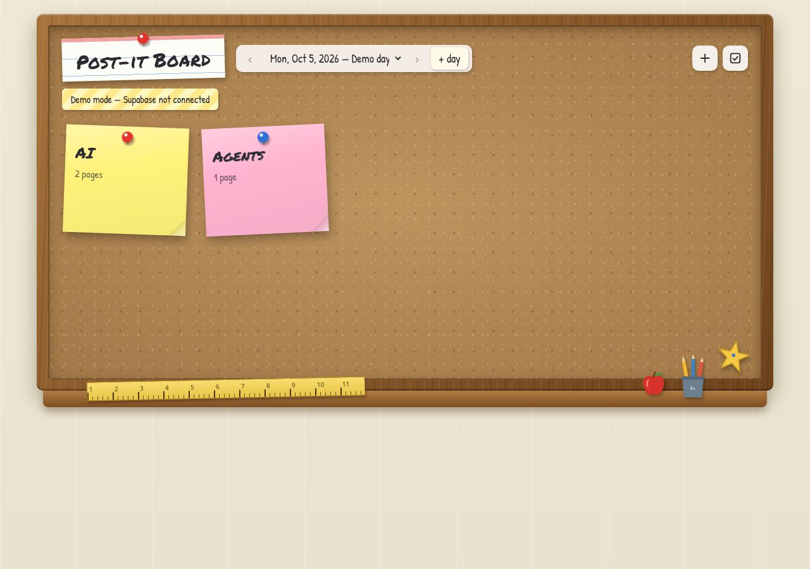

# 📌 Post-it Board

A tiny static website that looks like a middle-school classroom corkboard.
Each **day** gets its own board. Each conversation **topic** is one **pin** (a colored
sticky note), and each pin holds one or more **pages** of notes.

**Live site:** https://mogesjohnson.github.io/post-it-board/ (once GitHub Pages is on, see below)

Plain HTML + CSS + vanilla JS. No frameworks, no build step, no dependencies.



## Data model

```
Day (board_date)            e.g. 2026-10-05
 └─ Pin (topic)             e.g. "AI"         <- one sticky note per topic
     └─ Page (note)         e.g. page 1 "What is AI", page 2 "LLMs"
```

| table   | columns |
|---------|---------|
| `days`  | `id`, `board_date` (unique), `title`, `created_at` |
| `pins`  | `id`, `day_id → days` (on delete cascade), `title`, `color` (yellow/pink/blue/green), `position`, `created_at`, `updated_at` |
| `pages` | `id`, `pin_id → pins` (on delete cascade), `title`, `body`, `position`, `created_at`, `updated_at` |
| `board_owners` | `user_id → auth.users` (on delete cascade), `label`, `created_at`: who may write |

Deleting a pin permanently deletes its pages. There is no recycle bin.

## Using the board

- **Day picker** (top): newest day first. Use ‹ › to step to older/newer days.
- **Click a pin** to open it. You see page 1, can go to the previous/next page (or use ← →), and can
  jump with the page chips. **← All pins** (or Esc) takes you back.
- **Owner tools** (only when signed in, or in demo mode):
  - **+** adds a pin (on the board) or a page (inside a pin); **+ day** starts a new day.
  - **✎** renames a pin or edits a page.
  - **☑ Select mode** puts a checkbox on every pin (the whole pin, all pages) and on every page.
    The **🗑 trash can** asks you to confirm, then deletes the selected items for good.
- **🔒 Lock icon:** owner sign-in (email + password). Everyone else gets a read-only board.

Links are shareable via the URL hash, e.g. `#day=2026-10-05&pin=<id>&page=2`.

## Files

| file | what it does |
|------|--------------|
| `index.html` | page layout and decorations (ruler, apple, pencil cup, gold star) |
| `styles.css` | corkboard, wooden frame, sticky notes, pushpins, animations, phone layout |
| `app.js` | the UI: days, pins, pages, select mode, delete, sign-in |
| `store.js` | storage layer (Supabase REST or local demo) + Supabase Auth session |
| `config.js` | Supabase URL + **public anon key** (empty = demo mode) |
| `config.example.js` | example of a filled config |
| `supabase/schema.sql` | tables, cascade deletes, `board_owners`, Row Level Security policies (idempotent) |
| `scripts/post.mjs` | command-line poster the bot uses (quick add + JSON command files) |
| `.github/workflows/inbox.yml` | applies JSON commands pushed to the `inbox` branch |
| `scripts/write-config.mjs` | writes `config.js` from env vars |
| `tests/` | offline tests for `post.mjs` and the inbox workflow step (`node tests/run.mjs`, `bash tests/workflow.sh`) |
| `.nojekyll` | tells GitHub Pages to serve files as-is |

## Demo mode

If `config.js` is empty, the board runs in **demo mode**: data lives in your browser's
`localStorage`, seeded with one day containing the pin **AI** (pages "What is AI", "LLMs") and the pin
**Agents** (page "LLMs with loops"). A banner says *"Demo mode — Supabase not connected"*. Everything
works (add, edit, delete), but only in that browser. To reset the demo, clear the site data
(or run `localStorage.removeItem("postit.demo.v1")` in the console).

## Connecting Supabase (free plan)

Everything here works on the free plan: just Postgres tables, Row Level Security and Supabase Auth.
No Edge Functions, no paid add-ons.

**Who can do what**

| who | read | add / edit / delete |
|-----|------|---------------------|
| anyone with the site (anon key) | ✅ | ❌ |
| signed-in users listed in `public.board_owners` (you + the bot) | ✅ | ✅ |
| any other signed-in user | ✅ | ❌ |

Write access is controlled by a tiny table, `public.board_owners(user_id → auth.users)`. Every
insert/update/delete policy on `days`/`pins`/`pages` checks `public.is_board_owner()`, a
`security definer` helper that looks the current user up in that table. `board_owners` has RLS on and
no anon access; a signed-in user can only see their own row. You manage it from the SQL editor.

Steps:

1. **Create the tables.** Paste `supabase/schema.sql` into *SQL Editor* and click **Run**. Nothing to edit
   first. The script is idempotent, so re-running it later (e.g. after an update) is safe and keeps your data.
2. **Create the accounts.** Go to *Authentication → Users → Add user* and create:
   - your own owner account (email + strong password), and
   - the bot account `johnsonmoges+postit-bot@gmail.com` (used by `scripts/post.mjs`).

   Tick "Auto confirm user" for both. Then turn off public sign-ups
   (*Authentication → Sign In / Providers → Allow new users to sign up* = off).
3. **Make them board owners** (SQL Editor):
   ```sql
   select id, email from auth.users order by created_at;               -- find the ids
   insert into public.board_owners(user_id) values ('<uuid>') on conflict do nothing;   -- once per user
   ```
   To revoke access: `delete from public.board_owners where user_id = '<uuid>';`
4. **Point the site at your project.** Find the values in *Project Settings → API*:
   ```bash
   SUPABASE_URL=https://<ref>.supabase.co SUPABASE_ANON_KEY=<public anon key> node scripts/write-config.mjs
   ```
   (Or just edit `config.js` by hand.) Then get `config.js` onto `main` through a pull request, since
   `main` doesn't accept direct pushes (see [Branch protection](#branch-protection)). The anon/publishable key is **meant to be public**. RLS keeps it
   read-only. **Never** put the `service_role` / secret key in `config.js`. The script refuses it.
5. Open the site and click the **🔒 lock**. Sign in with your owner email and password. The **+**, select
   and trash tools appear. The session is kept in `localStorage` and refreshed automatically. Click the
   lock again to sign out. (Signing in with an account that isn't in `board_owners` still shows the
   tools, but every change is rejected by the database.)

## How the bot posts

`scripts/post.mjs` (Node 18+, no dependencies) finds or creates the day, finds or creates the pin
(the topic name is matched without regard to case), and appends a page at the end. It signs in
as the **bot account**, which is listed in `public.board_owners`, so it goes through the same RLS
rules as the website:

```bash
export SUPABASE_URL=https://<ref>.supabase.co
export SUPABASE_ANON_KEY=<public anon key>
export SUPABASE_OWNER_EMAIL=johnsonmoges+postit-bot@gmail.com   # the bot account (must be in board_owners)
export SUPABASE_OWNER_PASSWORD=<bot password>

node scripts/post.mjs --date 2026-10-05 --pin "AI" --page-title "LLMs" --body "Large language models predict the next word."
echo "long text..." | node scripts/post.mjs --pin "Agents" --page-title "Loops" --body -
node scripts/post.mjs --pin "Python" --body-file notes.txt --color green
node scripts/post.mjs --pin "AI" --body "test" --dry-run        # shows what it would do
```

- `--date` defaults to today in America/New_York. `--color` and `--day-title` only apply when the pin or day is created.
- A literal `\n` inside `--body` becomes a line break.
- Fallback auth: if `SUPABASE_OWNER_EMAIL`/`PASSWORD` aren't set, it uses `SUPABASE_SERVICE_KEY`
  (alias `SUPABASE_KEY`), which bypasses RLS. Keep that key secret and out of the repo.
- It prints one JSON line (`day_id`, `pin_id`, `page_id`, `page_number`) on success.

Credentials only ever come from environment variables. Nothing secret is stored in this repo.

## Inbox: add, edit and delete via GitHub (for assistants like Ara)

An assistant that can only push files to GitHub can still edit the board. It pushes **one JSON command
file** to `inbox/<unique-name>.json` on the **`inbox` branch**. The
[inbox workflow](.github/workflows/inbox.yml) then:

1. runs `node scripts/post.mjs --command-file inbox/<name>.json --result-file inbox/results/<name>.json`
   (scripts come from `main`, so script updates apply right away), signed in as the bot account;
2. writes the result to `inbox/results/<name>.json`, deletes the command file, and pushes
   `inbox: processed … [skip ci]` back to `inbox`.

Full docs: [`inbox/README.md` on the inbox branch](https://github.com/mogesjohnson/post-it-board/blob/inbox/inbox/README.md).

```jsonc
{"op": "add"|"edit"|"delete", "date": "YYYY-MM-DD" /* default today (New York) */, "pin": "Topic",
 "title": "page title", "body": "text", "color": "yellow|pink|blue|green",
 "target": "pin"|"page" /* edit/delete */, "page": "page title" | "pageNumber": 2, "newPin": "new pin title"}
```

- **add** matches the pin loosely on that day:
  - case, spaces, punctuation and Latin accents are ignored ("postit board" finds "Post-it Board", "cafe"
    finds "Café"). A match like this always wins: the typo and prefix rules below are only tried when there
    is none;
  - a small typo is allowed in words made only of letters, 5+ letters long in both spellings: one missing,
    extra or swapped letter that keeps the first letter, in at most 2 words of a title with the same number of
    words ("QA Live Zebar" finds "QA Live Zebra", "AI agent" finds "AI agents"). A *changed* letter never
    counts, and short words and numbers must match exactly, so "Code"/"Node", "Cars"/"Cats", "Bread"/"Break",
    "AI"/"UI" and "Order 10243"/"Order 10234" stay separate pins;
  - a whole-word prefix counts ("Python lists" finds "Python") when the shorter title has 4+ letters or digits
    (spaces don't count, so "Git" and "Git tips" stay separate);
  - titles with no letters or digits (e.g. "🚗") must match exactly (❤️ and ❤ count as the same).

  Known trade-offs: real words one missing, extra or swapped letter apart still merge ("Plants"/"Planets",
  "Trail"/"Trial", "Diary"/"Dairy", "Angel"/"Angle"), and plurals of 4-letter words don't ("Lesson plan" makes
  a new pin next to "Lesson plans"). Reuse the exact pin title when you know it.

  With no match it creates the pin. With several possible typo/prefix matches (and no exact one) it writes nothing (`skipped_ambiguous`).
  If a page with the same title **and** text was added to that pin in the last 10 minutes, it skips it
  (`skipped_duplicate`, with that page's `pageNumber`).
- **edit/delete** need an exact pin title (case-insensitive) and an exact page title or `pageNumber`.
  They never guess (`skipped_not_found` / `skipped_ambiguous`). Deleting a pin deletes its pages.
- Statuses: `ok`, `skipped_duplicate`, `skipped_ambiguous`, `skipped_not_found`, `error_invalid` (exit 0,
  command removed) and `error` (real failure: exit 1, command kept so a re-run retries it). One failed command
  doesn't stop the others in the same run.
- If the workflow can't push the results back to `inbox` (5 attempts), the run **fails** with an error that
  names only the commands that changed the board (status `ok`). Those are still waiting in `inbox/`, so the
  next run (a manual re-run, or any new command pushed to `inbox`) would apply them again: delete just those
  command files right away. Leave the others; they didn't change anything.

Examples:
```json
{"op": "add", "pin": "AI", "title": "LLMs", "body": "Large language models predict the next word."}
{"op": "edit", "target": "page", "date": "2026-10-05", "pin": "AI", "pageNumber": 2, "body": "Corrected text."}
{"op": "delete", "target": "pin", "date": "2026-10-05", "pin": "AI"}
```

The workflow uses four repository secrets: `SUPABASE_URL`, `SUPABASE_ANON_KEY`, `SUPABASE_OWNER_EMAIL`
(the bot account) and `SUPABASE_OWNER_PASSWORD`. Keep `.github/workflows/inbox.yml` identical on `main`
and `inbox`; pushes to `inbox` run the copy on that branch. A change to it goes onto `main` through a pull
request and onto `inbox` with a normal push.

## Branch protection

`main` is protected by a branch ruleset, and `inbox` is left open on purpose.

**Ruleset [Protect main](https://github.com/mogesjohnson/post-it-board/rules/24617788)** (ID `24617788`,
enforcement **Active**, created 2026-10-06). It applies to the default branch (`main`) only:

| setting | what it does |
|---------|--------------|
| **Require a pull request before merging** | Every change reaches `main` through a pull request. Required approvals are set to **0**, because GitHub won't let you approve your own pull request; as the only maintainer you can still open and merge your own. |
| **Block force pushes** | Nobody can rewrite `main`'s history. |
| **Restrict deletions** | Nobody can delete `main`. |
| **Bypass: Repository admin, *For pull requests only*** | The admin (you) can merge a pull request even when a rule would otherwise block the merge, but can never push to `main` directly. Don't switch this to *Always allow*: the inbox token acts as you, so a leaked token could then push to `main` too. |

**Why `main` is protected.** The inbox workflow runs `main`'s `scripts/post.mjs` with the Supabase bot
secrets, and GitHub Pages serves the live site from `main`. Anyone who can push to `main` could change that
script to leak the bot password, or change the site. Assistants like Ara push with a token that acts as you,
so without the ruleset a leaked token could do exactly that.

**Why `inbox` is open.** Ara, the transcript poller (planned) and the inbox workflow's own result commits all
push straight to `inbox`. A pull-request rule there would quietly stop posting: commands would sit on
unmerged branches and never reach the workflow. What a leaked token can do on `inbox` is limited to adding,
editing or deleting notes, which you undo by reverting with git and revoking the token. Two things keep it
that way:

- Pushes to `inbox` run the copy of `inbox.yml` on that branch, but GitHub refuses any push that changes
  `.github/workflows/` from a token without the *Workflows* permission. Keep the inbox token at
  **Contents read/write** only.
- A Contents-write token can still merge an open pull request from a post-it-board branch, so don't leave
  those open.

**Changing `main` from now on:**

```bash
git switch -c my-change
# edit, then commit
git push -u origin my-change
gh pr create --fill
gh pr merge --merge --delete-branch
```

A direct `git push` to `main` is rejected with `GH013: Repository rule violations found`.

**Checks (2026-10-06):**

- GitHub's rules API lists the three rules on `main` and none on `inbox`:
  ```bash
  gh api repos/mogesjohnson/post-it-board/rules/branches/main --jq '.[].type'   # pull_request, non_fast_forward, deletion
  gh api repos/mogesjohnson/post-it-board/rules/branches/inbox                  # []
  ```
- The inbox workflow checks out `main` only to read the scripts. Its one push is
  `git push origin HEAD:inbox`, so the pull-request rule on `main` doesn't affect posting.
- A direct push to `main` was rejected. The test used the commit that added this section, which then
  reached `main` through a pull request instead.

**To view or change the ruleset:** *Settings → Rules → Rulesets → Protect main*, or
`gh api repos/mogesjohnson/post-it-board/rulesets/24617788`. Setting enforcement to *Disabled* switches it
off without deleting it.

## GitHub Pages

*Settings → Pages → Build and deployment → Source: Deploy from a branch → Branch: `main` / `(root)` → Save.*
After a minute the board is live at https://mogesjohnson.github.io/post-it-board/.

## Local preview

```bash
python3 -m http.server 8000   # then open http://localhost:8000
```
